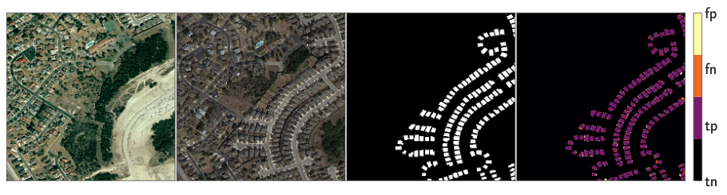
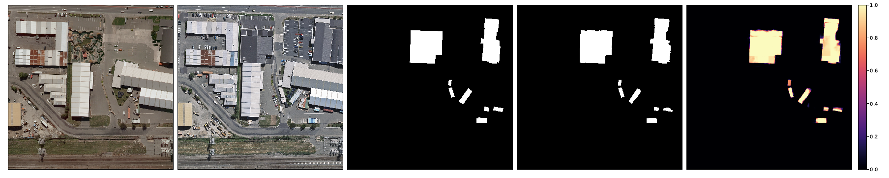
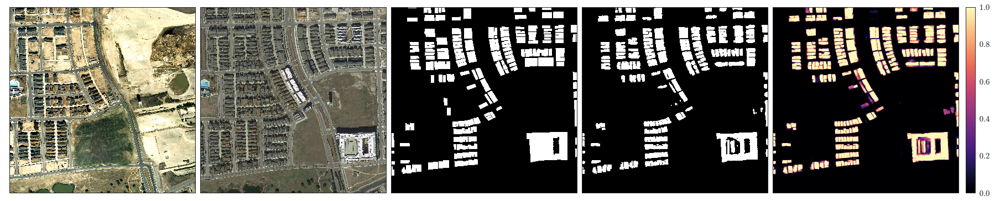
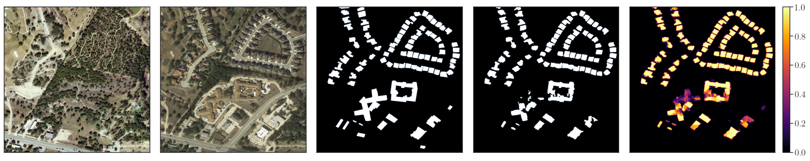
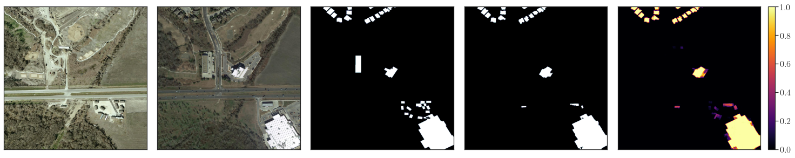
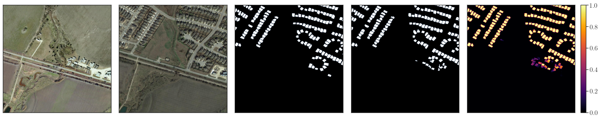
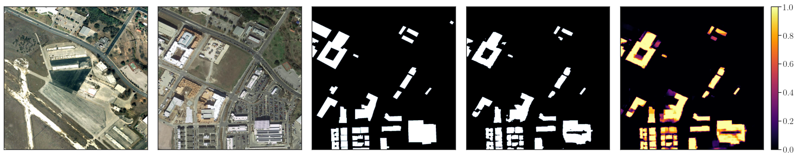
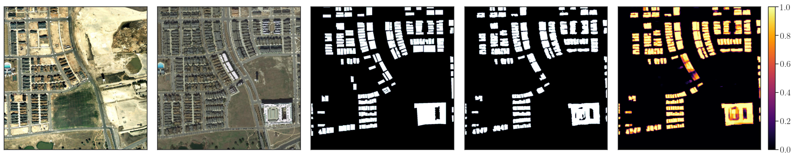
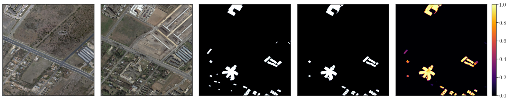

# ** UPDATE **
We added a pure semantic segmentation model that uses CEECNetV1, CEECNetV2 or FracTAL ResNet micro-topologies, based on a single encoder/decoder macro-topology (unet-like). These can be found in location: ```models/semanticsegmentation/x_unet```. 

# Looking for change? Roll the Dice and demand Attention


Official [mxnet](https://mxnet.incubator.apache.org/) implementation of the paper: ["Looking for change? Roll the Dice and demand Attention" (arxiv version)](https://arxiv.org/abs/2009.02062), [Diakogiannis et al. (2020 - journal version)](https://www.mdpi.com/2072-4292/13/18/3707). This repository contains source code for implementing and training the mantis ceecnet/FracTAL ResNet as described in our manuscript. All models are built with the mxnet DL framework (version < 2.0), under the gluon api. We do not provide pre-trained weights. 

Inference examples for the task of Building change detection for the model mantis ceecnetV1 (fractal Tanimoto loss tdepth, ftdepth=5). From left to right, input image date 1, input image date 2, ground truth, inference, confidence heat map for the segmentation task. 



Inference examples for the task of Building change detection for the model mantis ceecnetV2 (ftdepth=5). Order of figures as above.  These are for the difficult tiles 21, 71, 72, 77, 80, 101 from the test set. 








### Directory structure: 

```
.
├── chopchop
├── demo
├── doc
├── images
├── models
│   ├── changedetection
│   │   └── mantis
│   ├── heads
│   └── semanticsegmentation
│       └── x_unet
├── nn
│   ├── activations
│   ├── layers
│   ├── loss
│   ├── pooling
│   └── units
├── src
└── utils
```

In directory ```chopchop``` exists code for splitting triplets of raster files (date1, date2, ground truth) into small training patches. It is tailored on the LEVIR CD dataset. In  ```demo``` exists a notebooks that shows how to initiate a mantis ceecnet model, and perform forward and multitasking backward operations. In ```models/changedetection/mantis``` exists a generic definition for arbitrary depth and number of filters, that are described in our manuscript. In ```nn``` exist all the necessary building blocks to construct the models we present, as well as loss function definitions. In particular, in ```nn/loss``` we provide the average fractal Tanimoto with dual (file ```nn/loss/ftnmt_loss.py```), as well as a class that can be used for multitasking loss training. Users of this method may want to write their own custom implementation for multitasking training, based on the ```ftnmt_loss.py``` file. See ```demo``` for example usage with a specific ground truth labels configuration. In ```src``` we provide a mxnet Dataset class, as well as a normalization class. Finally, in utils, there exist a function for selecting BatchNormalization, or GroupNorm, as a paremeter. 


### Datasets 
Users can find the datasets used in this publication in the following locations:  
LEVIR CD Dataset: https://justchenhao.github.io/LEVIR/  
WHU Dataset: http://gpcv.whu.edu.cn/data/building_dataset.html  


### License
CSIRO BSTD/MIT LICENSE

As a condition of this licence, you agree that where you make any adaptations, modifications, further developments, 
or additional features available to CSIRO or the public in connection with your access to the Software, you do so on the terms of the BSD 3-Clause Licence template, a copy available at: http://opensource.org/licenses/BSD-3-Clause.


### CITATION
If you find the contents of this repository useful for your research, please cite:
```
@Article{rs13183707,
AUTHOR = {Diakogiannis, Foivos I. and Waldner, François and Caccetta, Peter},
TITLE = {Looking for Change? Roll the Dice and Demand Attention},
JOURNAL = {Remote Sensing},
VOLUME = {13},
YEAR = {2021},
NUMBER = {18},
ARTICLE-NUMBER = {3707},
URL = {https://www.mdpi.com/2072-4292/13/18/3707},
ISSN = {2072-4292},
ABSTRACT = {Change detection, i.e., the identification per pixel of changes for some classes of interest from a set of bi-temporal co-registered images, is a fundamental task in the field of remote sensing. It remains challenging due to unrelated forms of change that appear at different times in input images. Here, we propose a deep learning framework for the task of semantic change detection in very high-resolution aerial images. Our framework consists of a new loss function, a new attention module, new feature extraction building blocks, and a new backbone architecture that is tailored for the task of semantic change detection. Specifically, we define a new form of set similarity that is based on an iterative evaluation of a variant of the Dice coefficient. We use this similarity metric to define a new loss function as well as a new, memory efficient, spatial and channel convolution Attention layer: the FracTAL. We introduce two new efficient self-contained feature extraction convolution units: the CEECNet and FracTALResNet units. Further, we propose a new encoder/decoder scheme, a network macro-topology, that is tailored for the task of change detection. The key insight in our approach is to facilitate the use of relative attention between two convolution layers in order to fuse them. We validate our approach by showing excellent performance and achieving state-of-the-art scores (F1 and Intersection over Union-hereafter IoU) on two building change detection datasets, namely, the LEVIRCD (F1: 0.918, IoU: 0.848) and the WHU (F1: 0.938, IoU: 0.882) datasets.},
DOI = {10.3390/rs13183707}
}
```
